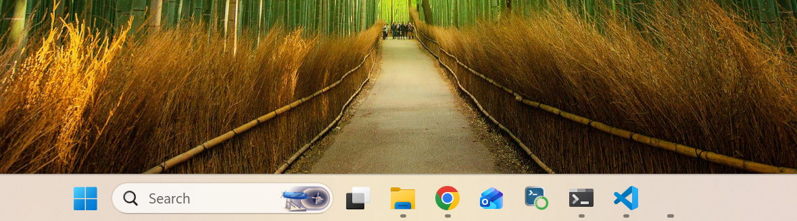

# Instala Python  {.unnumbered}

En este curso se recomienda instalar Python con [miniconda](https://www.anaconda.com/download). 
Asegurate de descargar miniconda.

# Instala uv de Astral  {.unnumbered}

Como manejador de ambientes virtuales recomiendo instalar [uv de Astral](https://docs.astral.sh/uv/).

# Tips  {.unnumbered}

Te recomiendo buscar la `Anaconda PowerShell Prompt` y anclarla en tu barra de tareas
y que se vea como en la siguiente imagen:



#  Cheat sheet rápido  {.unnumbered}

```text
# ── HOME ──────────────────────────────────────
cd ~              # Ir a tu carpeta personal (SIEMPRE funciona)

# ── CREAR ─────────────────────────────────────
mkdir  mi_proyecto   # Crear carpeta `mi_proyecto`
# Nombre: sin espacios, sin acentos, minúsculas + guion_bajo

# ── MOVERSE ───────────────────────────────────
cd ..             # Subir o salir un nivel
cd ~              # Volver a HOME
cd mi_proyecto    # Entrar a carpeta con ese nombre

# ── VER ───────────────────────────────────────
ls                # Listar (Win: dir)
pwd               # ¿Dónde estoy?

# ── ABRIR EXPLORADOR ──────────────────────────
ii .        # Windows
open .            # macOS
```

---

##  Buenas practicas

1. Trabaja SIEMPRE desde tu HOME o un subdirectorio tuyo. Evita `C:\` o `/` raíz.
2. Nombres sin espacios. `machine_learning` > `Machine Learning`.
4. `cd ~` cuando te pierdas. No busques, vuelve a casa.
5. Un proyecto = una carpeta.


#  Creacion de ambientes virtuales con `uv`  {.unnumbered}

Para crear un ambiente virtual y su carpeta, al mismo tiempo:

`uv init nombre_proyecto`

Para agregar un paquete en ese proyecto, primero tienes que entrar 
a ese proyecto y luego agregar el paquete

`cd nombre_proyecto`

`uv add jupyter notebook`

Para correr la libreta de jupyter, hay que estar en el espacio, que tenga instalado jupyter notebook,
y ejecutar todo con:

`uv run jupyter notebook`


## Ejercicio en clase {.unnumbered}

Vamos a crear una carpeta en tu home (tu carpeta personal, donde vives) que se llama `curso_python/`. Todo lo que hagamos durante el curso
va a vivir ahí. Dentro de esa carpeta vamos a ir creando proyectos con un número delante, como `001_hola_mundo`, `002_variables`,
`003_funciones`, y así. El número nos sirve para que, cuando tengas 15 proyectos, los ves ordenados y sabes cuál fue primero y cuál fue
después.

Empezamos con el primero: `001_hola_mundo`.

---

Desde la terminal, ya en tu home, hacemos esto:

```bash
mkdir curso_python
cd curso_python
```
Creamos la carpeta con `mkdir` por que no es un proyecto de python.

Ahora estamos dentro de `curso_python/`. Aquí van a nacer todos los proyectos.

Para crear el primer proyecto usamos `uv init nombre_proyecto`. Ten cuidado que `nombre_proyecto` cambie de acuerdo a lo que necesitas. `uv init` nos crea la estructura base: un `pyproject.toml`, una carpeta `src/`, lo justo para que Python sepa que aquí hay un
proyecto.

```bash
uv init 001_hola_mundo
```

Eso nos crea la carpeta `001_hola_mundo/` con lo básico. Ahora entramos:

```bash
cd 001_hola_mundo
```

Ya estamos dentro. Ahora le decimos a `uv` que queremos Jupyter Notebook como dependencia de este proyecto. `uv add` hace dos cosas a la
vez: descarga el paquete y lo registra en el `pyproject.toml`. Así, si mañana borras la carpeta virtual y la recreas, Jupyter vuelve solo.

```bash
uv add jupyter notebook
```

Listo. Ya tienes:

```
~/curso_python/
  └── 001_hola_mundo/
        ├── pyproject.toml
        └── .venv/          (virtualenv, invisible pero existe)
```

Y para probar que Jupyter arranca:

```bash
uv run jupyter notebook
```
Recuerda que debes estar adentro de `curso_python/001_hola_mundo`.

`uv run` ejecuta el comando usando la virtualenv del proyecto, sin que tengas que hacer `source .venv/bin/activate` antes. Se abre el
navegador, creas un notebook, escribes `print("hola")` y ya tienes tu primer proyecto funcionando.

---

Resumen de lo que hicimos, en una línea:

`mkdir` → `cd` → `uv init` → `cd` → `uv add` → `uv run`

Cinco comandos, y tienes un proyecto aislado, numerado, con sus dependencias registradas. Cuando hagamos el `002_variables`, repetimos
exactamente lo mismo desde `curso_python/`, y todo queda ordenado sin mezclarse.
